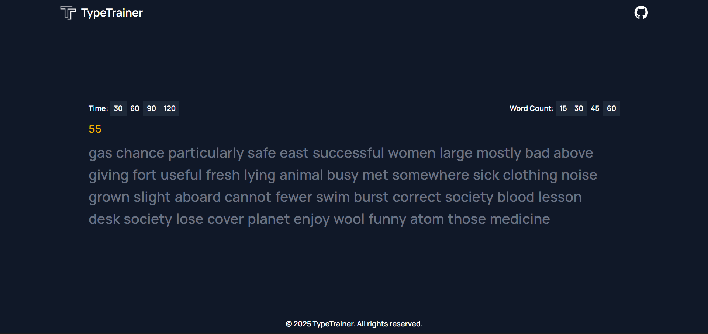

<p align="center">

</p>

# TypeTrainer

**TypeTrainer** is a sleek and customizable typing practice web app built with **Next.js**, **TypeScript**, and **Tailwind CSS**. It's designed to help users improve their typing speed and accuracy with real-time feedback.

---

## 🚀 Features

- ⏲️ **Adjustable Test Duration**  
  Choose how long the typing test lasts (e.g., 30s, 60s, 120s).

- 📝 **Configurable Word Count**  
  Set how many random words you want to type in each test.

- 📊 **Performance Summary**  
  Get detailed results when the test ends like WMP, accuracy etc.

- 💡 **Live Feedback**  
  See which characters and words are correct or incorrect as you type.

- 🌙 **Minimal & Clean UI**  
  Dark-mode aesthetic with responsive design for all screen sizes.

---

## 📦 Getting Started

### 1. Clone the Repo

```bash
git clone https://github.com/bhavishya2601/typetrainer.git
cd typetrainer
```

### 2. Install Dependencies

```bash
npm install
```

### 3. Start the Development Server

```bash
npm run dev
```

Visit [http://localhost:3000](http://localhost:3000) to start typing!

---

## 🖼️ Preview

## 

## 📬 Contact

Have questions or ideas? Reach out via GitHub or open an issue.  
Let’s help the world type faster — one keystroke at a time! ⌨️✨

---

## License

This project is licensed under the MIT License. See the [LICENSE](LICENSE) file for details.
